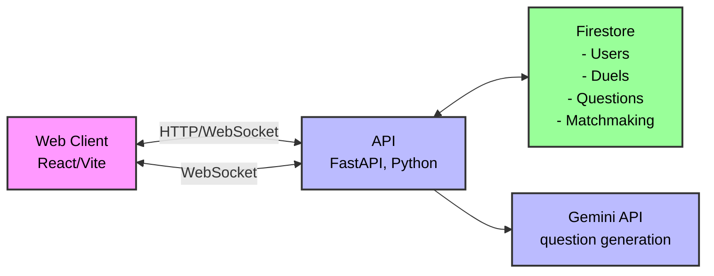
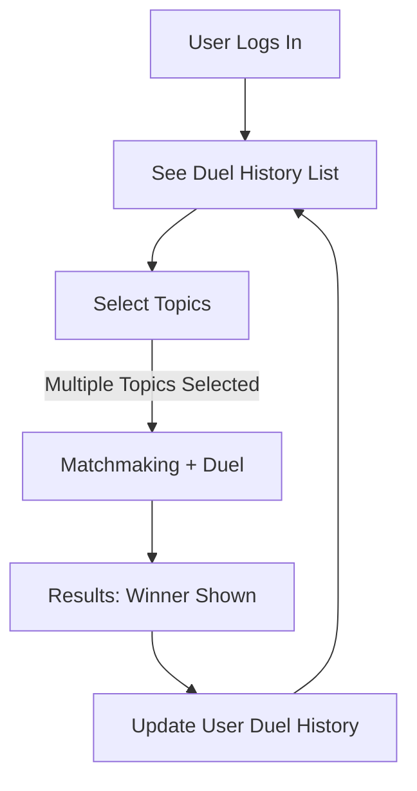

# CodeDuel Architecture

## Overview

CodeDuel is a real‑time quiz duel where two users select a topic and compete by answering 10 questions. A duel lasts 90 seconds in total, with 9 seconds allocated per question. Questions and canonical answers are generated ahead of time using Google Gemini to ensure low latency during live play.

- Total questions per duel: 10
- Time per question: 9 seconds
- Total duel time budget: ~90 seconds (plus a small buffer for connection/setup)
- Play mode: 1v1 synchronous duel (future: solo practice and tournaments)

Assumptions:

- "Match" == one question round. There are 10 matches in a duel.
- To reduce ambiguity, questions are multiple-choice by default. Free‑text mode can be a future enhancement with model‑assisted evaluation.

## Goals and Non‑Goals

- Goals
  - Low-latency, synchronized question timing across two clients
  - Reliable scoring and anti‑cheat measures
  - Stable question generation with topic alignment
  - Simple, scalable architecture that can be deployed quickly (hackathon‑friendly)
- Non‑Goals (initial version)
  - Complex ranking algorithms beyond basic ELO
  - Cross‑platform native apps (start with Web)

## High-Level Architecture



## Components

- Frontend (Web)
  - React + Vite + TypeScript
  - WebSocket client for real‑time
  - UI: topic selection, matchmaking lobby, duel view with timer, results screen
- Backend API
  - FastAPI (Python)
  - WebSocket support for real-time communication
  - REST endpoints for auth, topic listing, duel creation, admin tools
  - Firestore Admin SDK for data operations
- Data Stores
  - Firestore for all data including:
    - Persistent data (users, duels, questions, results)
    - Matchmaking queues (using Firestore real-time updates)
    - Game state and timers (using Firestore transactions and server timestamps)
- External
  - Gemini API for generating question sets per topic
  - Optional: Turnstile/Recaptcha for bot mitigation

## User Flow



### Detailed Flow

1. User logs in (guest or OAuth).
2. User selects one or more topics and taps Duel.
3. Backend enqueues the user in the selected topics' matchmaking queues.
   - Questions will be randomly selected from the chosen topics
4. When two users match, backend:
   - Creates a duel record
   - Generates (or retrieves cached) 10 multiple-choice questions via Gemini
   - Sends both clients the duel room ID and pre-game countdown
5. Duel starts: server broadcasts Q1 and starts a 9s server‑side timer.
6. For each question:
   - Clients submit answers; server records timestamp and correctness
   - On timeout or both answers received, server moves to next question
7. After Q10, server finalizes scores and broadcasts results.
8. Results are saved to user history
9. User returns to duel history, ready for next match

## Game Rules & Timing

- 10 questions per duel
- 9 seconds per question, enforced by server timer
- Scoring
  - Correct = +10 points (configurable)
  - Optional time bonus: +1 point per second remaining (configurable)
  - Incorrect/No answer = 0 points
- Ties allowed; optionally trigger a tiebreaker sudden‑death question

## Synchronization & Timer Strategy

- Server authoritative timers using Firestore's real-time updates
- Emit `question_start` with `questionIndex` and `deadline` (epoch ms)
- Clients display countdown based on `deadline`; server enforces cutoff
- Late answers (post‑deadline) are rejected using Firestore transactions

## MVP Implementation

### Screens and Actions

### 1. Login/Signup Screen

- **Actions**:
  - Guest login (generates temporary user ID)
  - OAuth login (Google/GitHub)
  - Store user session in browser storage

### 2. Topic Selection Screen

- **Components**:
  - List of available topics (Data Structures, Algorithms, etc.)
  - Multi-select functionality
  - Start Duel button (enabled when ≥1 topic selected)
  - Duel History button

- **State**:
  - Selected topics array
  - Loading state for matchmaking

### 3. Matchmaking Screen

- **Components**:
  - Selected topics display
  - Animated "Finding opponent..." indicator
  - Cancel button

- **Actions**:
  - WebSocket connection to matchmaking service
  - Handle match found event
  - Handle cancellation

### 4. Duel Lobby (Pre-Game)

- **Components**:
  - Opponent's username/avatar
  - Selected topics
  - Ready check
  - 3-2-1 countdown

- **State**:
  - Both players ready status
  - Countdown timer

### 5. Duel Screen

- **Components**:
  - Question prompt
  - 4 multiple-choice options
  - Timer (9s per question)
  - Score display
  - Question progress (X/10)

- **Actions**:
  - Submit answer
  - Handle timeout
  - Show correct/incorrect feedback

### 6. Results Screen

- **Components**:
  - Final scores
  - Question-by-question breakdown
  - Rematch button
  - Back to topics button
  - Share result option

- **Data**:
  - Score history
  - Correct/incorrect answers
  - Time taken per question

## Question Generation (Gemini)

- Strategy: Pre‑generate the full set of 10 MCQs with 1 correct + 3 distractors before duel start to avoid mid‑duel latency.
- Prompt includes:
  - Topic
  - Difficulty target
  - Required output JSON schema
  - Constraints: unique, clear, unambiguous, varying subtopics, concise options, 1 correct answer
- Caching:
  - Cache recent topic question sets for 5–10 minutes to reduce API usage
- Safety:
  - Rate limit per IP/user
  - Validate schema server‑side; fallback to regeneration if invalid

### Example Question JSON

```json
{
  "id": "q_01",
  "prompt": "Which sorting algorithm has average time complexity O(n log n)?",
  "options": ["Bubble Sort", "Merge Sort", "Insertion Sort", "Selection Sort"],
  "correctIndex": 1,
  "explanation": "Merge Sort divides and conquers to achieve O(n log n).",
  "topic": "algorithms",
  "difficulty": "medium"
}
```

## Data Model (Firestore Collections)

### Users Collection

```typescript
{
  id: string;            // Auto-generated document ID
  username: string;      // Unique username
  rating: number;        // Default: 1200
  createdAt: Timestamp;
  updatedAt: Timestamp;
}
```

### Duels Collection

```typescript
{
  id: string;            // Auto-generated document ID
  topic: string;         // Selected topic
  status: 'pending' | 'active' | 'completed' | 'canceled';
  player1: {
    id: string;          // Reference to Users collection
    score: number;       // Current score in the duel
  };
  player2: {
    id: string;          // Reference to Users collection
    score: number;       // Current score in the duel
  };
  winnerId?: string;     // Reference to Users collection
  currentQuestion?: number; // 0-9 index
  questions: Array<{     // Subcollection or embedded array
    prompt: string;
    options: string[];
    correctIndex: number;
  }>;
  startedAt: Timestamp;
  endedAt?: Timestamp;
}
```

### Answers Subcollection (under each Duel document)

```typescript
{
  questionIndex: number;  // 0-9
  userId: string;        // Reference to Users collection
  selectedIndex: number; // 0-3
  correct: boolean;
  responseMs: number;    // Milliseconds after question start
  answeredAt: Timestamp;
}
```

## Data Access Layer

- Firestore provides real-time listeners for WebSocket-like functionality
- Security rules will be implemented to control read/write access
- Composite indexes will be created for common query patterns

## API Endpoints (REST)

- Auth
  - POST /api/auth/guest -> { user }
- Topics
  - GET /api/topics -> ["algorithms", "javascript", "python", ...]
- Duel
  - POST /api/duel/match -> { topic } => { queueTicket }
  - POST /api/duel/cancel -> { queueTicket }
  - GET /api/duel/:id -> duel summary
- Admin (optional)
  - POST /api/admin/generate-questions -> { topic, n } (secured)

## Realtime Events (Socket.IO)

- Client -> Server
  - join_queue { topic }
  - cancel_queue { ticketId }
  - answer { duelId, questionIndex, selectedIndex, clientTs }
- Server -> Client
  - matched { duelId, roomId, opponent }
  - pregame_countdown { startsAt }
  - question_start { duelId, questionIndex, deadline }
  - question_end { duelId, questionIndex, correctIndex, p1, p2 }
  - duel_end { duelId, results }
  - error { code, message }

## Matchmaking Flow

1. Client emits `join_queue { topic }`.
2. Backend adds user to Firestore collection `matchmaking/{topic}` with timestamp.
3. Firestore query listens for matching pairs (2 users in same topic).
4. When match found, create duel, generate questions, create room, notify clients.
5. Stale entries are cleaned up by Firestore TTL or scheduled function.

## Game State Machine (Server)

- pending -> active(Q0..Q9) -> completed
- Transitions driven by server timer; client answers do not advance the question index unless both answered early.

## Anti‑Cheat & Integrity

- Server authoritative time and scoring
- Reject answers after `deadline`
- Limit reconnect window (e.g., 5 seconds) with replay of current question state
- Basic anomaly checks (impossibly fast answers across many duels)
- Obfuscate correct answers in client payloads; only revealed after `question_end`

## Observability

- Structured logs: match lifecycle, question timings, answer rates
- Metrics: match_count, gen_latency, ws_connected, answer_correct_rate, abandons
- Tracing (optional): endpoint latency, Gemini call spans

## Deployment

- Single container service (API + WS) behind a reverse proxy (NGINX) or managed PaaS (Render/Heroku/Fly.io)
  - Firestore (managed)
- Env vars
  - GEMINI_API_KEY
  - FIRESTORE_CREDENTIALS (service account JSON)
  - RATE_LIMIT_* settings
  - ORIGIN / CORS_ALLOWED

## Security

- Basic token or signed guest session
- CORS locked to frontend origin
- Input validation (Zod/JOI)
- Rate limiting on REST and WS events

## Risks & Mitigations

- Model latency causes slow start -> Pre‑generate and cache sets; warm cache per topic
- WS disconnects -> allow short reconnect grace; keep state in Firestore
- Ambiguous questions -> enforce MCQ, strong prompts, and validation

## Roadmap

- v0
  - Guest auth, topic select, 1v1 matchmaking
  - Pre‑generated 10 MCQs, 9s per question
  - Scoring and results screen
- v1
  - ELO rating, basic leaderboard
  - Report question/feedback loop
- v2
  - Solo practice, tournaments, mobile PWA

## Appendix: Prompt Template (Gemini)

```text
You are a quiz generator. Produce EXACTLY N=10 multiple-choice questions for the topic: "{topic}".
Output must be a JSON array of objects with fields:
- id (string short id),
- prompt (string),
- options (array of 4 concise strings),
- correctIndex (0..3),
- explanation (1-2 sentences),
- topic (echo),
- difficulty ("easy"|"medium"|"hard").
Constraints:
- Each question must be unambiguous and factually correct.
- Only one correct option per question.
- Avoid repeating subtopics; vary coverage.
- Keep prompts under 160 characters.
- Ensure options are mutually exclusive.
```
